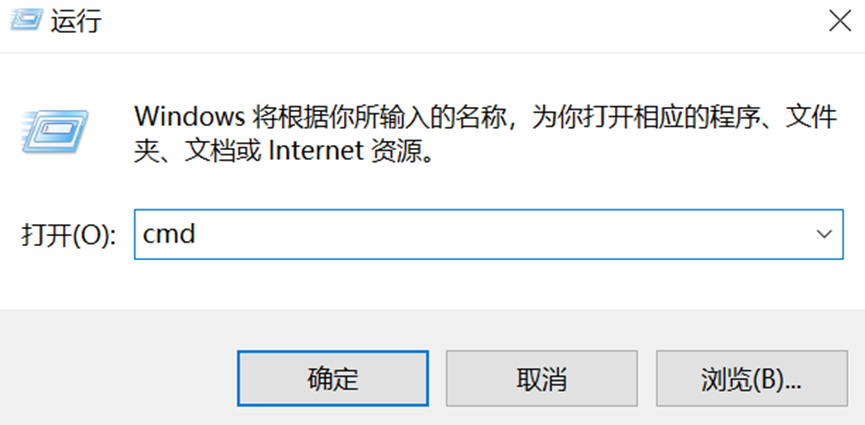
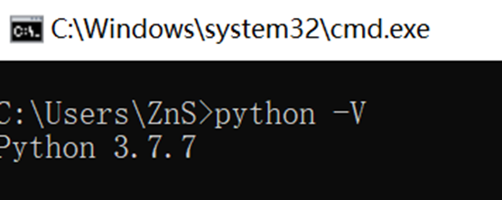
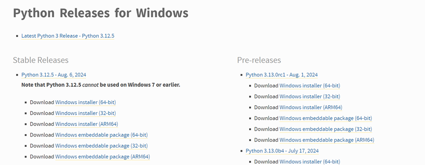
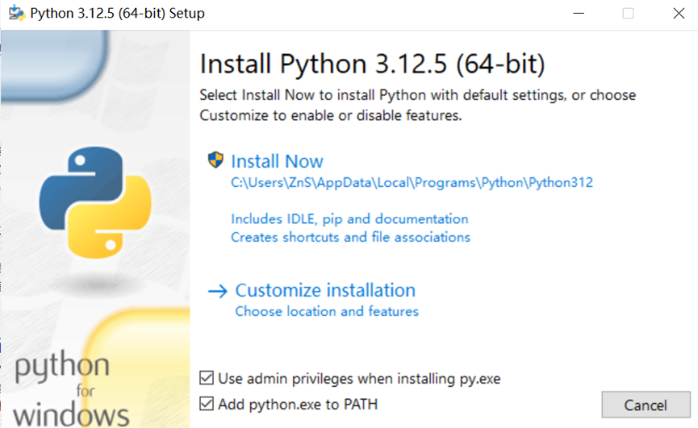
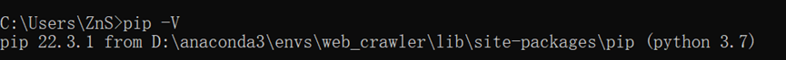
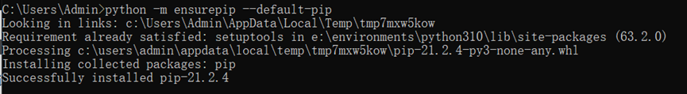

# 安装入门
作为一款开源工具，其优点是免费、有很大的社区快速地维护更新；缺点是安装比较麻烦。以下是EISeg的windows电脑安装教程。本教程没有编程基础的用户也能看懂。

# 1.	安装python
Python是一门编程语言，Label_studio需要python 3.6以上的版本。可以通过以下方式检查您的电脑是否符合要求:

1.1. 按住win键后再按R键，在出现的窗口输入cmd，回车，出现黑色命令行窗口。

1.2. 在黑色命令行窗口输入 python -V，显示版本号。如果结果为Python 3.X.Y, 而且X大于等于8即满足要求，可以跳过以下步骤，看2.步安装pip。

1.3. 开始安装python。进入python官网https://www.python.org/downloads/windows/

1.4. 如果电脑是64位，则点击Windows installer(64-bit)，否则是32位，点击Windows installer(32-bit)。你会下载好一个安装包
查看自己电脑是64位还是32位请[点击此教程](https://baijiahao.baidu.com/s?id=1808041429607662313&wfr=spider&for=pc). 一般而言,2018年以后的电脑大部分是64位的, 2020年以后的电脑绝大部分都是64位的

1.5. 下载好之后双击安装包，出现如下画面。勾选其中的“Add python.exe to PATH”,点击Install Now，稍作等待即可。完成后您便安装好了python 3.12.5版本

1.6. 您可以通过1.1和1.2步检查python是否安装成功，如果显示Python 3.12.5则安装成功

# 2.	安装pip
Pip是与python配套的包安装工具，我们需要使用这个工具安装label_studio.您可以通过以下方式查看您的电脑是否已经安装好了pip。

2.1	按住win键后再按R键，在出现的窗口输入cmd，回车，出现黑色命令行窗口。

2.2	在黑色的命令行窗口输入 `pip -V`。能够显示pip XX.X.X …即可. 如果后续安装过程遇到问题，可以尝试使用这条命令更新pip`python -m pip install --upgrade pip`. 您可以跳过以下步骤, 看[# 3. 安装label_studio].

2.3	在2.1的cmd窗口当中输入命令`python -m ensurepip --default-pip`出现如下图所示，代表安装成功：

2.4	安装完成之后，您可以执行2.1和2.2查看是否安装成功。
