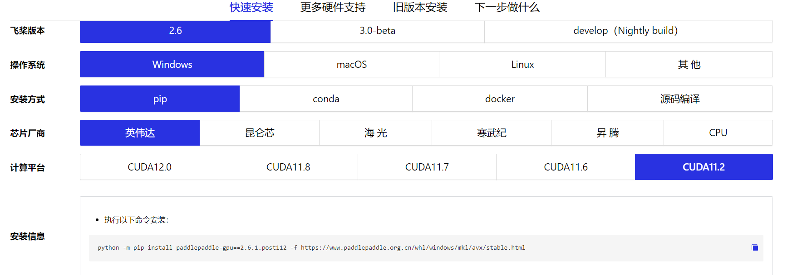

简体中文 | [English](install_en.md)
# 安装文档

# 必读!!!
安装过程之中如果系统报错,请您先运行eiseg确认程序是否能够正常运行,如果能够正常运行,请记录报错信息并且暂时搁置此报错. 如果不能正常运行,请查看[安装错误应对文档](Install/installerror.md)

请首先安装paddlepaddle之后,再安装paddleseg.

## 准备安装
首先需要安装python和pip，请保证您安装的python版本在3.6到3.10之间。

如果您不了解python, pip等等, 请您查看[安装入门](Install/installfornewbe.md)

EISeg提供多种安装方式，其中使用[pip](#PIP)和[克隆到本地](#克隆到本地)方式可兼容Windows，Mac OS和Linux。为了避免环境冲突，推荐在conda创建的虚拟环境中安装。如果您不了解conda可以不用理会此句. 


## 安装paddlepaddle

版本要求:

* PaddlePaddle >= 2.2.0

您必须首先安装PaddlePaddle才能够继续安装. PaddlePaddle安装请参考[官网]
如果您按照本教程进行操作，您可以执行如下指令快速安装paddlepaddle,使用CPU运行程序.
```shell
python -m pip install paddlepaddle==2.6.1 -i https://pypi.tuna.tsinghua.edu.cn/simple
```
如果您的机器有GPU,推荐使用以下指令安装paddlepaddle,使用GPU加速标注. 请确认您是否安装了cuda和cudnn.如果您不清楚cuda和cudnn,请阅读[安装入门](Install/installfornewbe.md)
如果以下使用GPU的指令安装失败,或者cuda\cudnn安装不顺利,请还是按照上面的指令进行安装到CPU上
```shell
python -m pip install paddlepaddle-gpu==2.6.1.post112 -f https://www.paddlepaddle.org.cn/whl/windows/mkl/avx/stable.html
```
(https://www.paddlepaddle.org.cn/install/quick?docurl=/documentation/docs/zh/install/pip/windows-pip.html)。



paddle eiseg这一个分割工具的安装方式有如下两种方法：1）方法1 pip方式安装，这也是推荐的安装方式；2）方法2 克隆到本地.


### 方法1 克隆到本地
本方法下载的程序拥有[点列功能](pcbseg/pointline.md),请用本方法
请**确保**您已经完成了PaddlePaddle的安装之后再执行接下来的步骤。paddlepaddle的安装在本页上面的部分。您也可以执行下面的指令快速安装paddlepaddle
```shell
python -m pip install paddlepaddle==2.6.1 -i https://pypi.tuna.tsinghua.edu.cn/simple
```
`-i https://pypi.tuna.tsinghua.edu.cn/simple`是国内的清华镜像,能够加速所有关于`pip`的操作. 所有涉及`pip`的操作如果速度太慢都可以考虑加上这一句.

通过git将定制的,具有点列功能的,jrsPaddleSeg克隆到本地：

```shell
git clone https://gitee.com/liu-hongxin2/jrs-pa.git
```

安装所需环境,如果你之前已经安装了paddleseg, **此步可以跳过**：

```shell
pip install -r requirements.txt
```

安装好所需环境后，进入EISeg，可通过直接运行eiseg打开EISeg：

```shell
cd jrsPaddleSeg\EISeg
python -m eiseg
```

或进入eiseg，运行exe.py打开EISeg：

```shell
cd jrsPaddleSeg\EISeg\eiseg
python exe.py
```


### 方法2 PIP
**本方法已废弃,因为不具有点列功能.**
请**确保**您已经完成了PaddlePaddle的安装之后再执行接下来的步骤。paddlepaddle的安装在本页上面的部分。您也可以执行下面的指令快速安装paddlepaddle
```shell
python -m pip install paddlepaddle==2.6.1 -i https://pypi.tuna.tsinghua.edu.cn/simple
```
使用pip安装方式如下：

```shell
pip install eiseg
```
#如果不成功, 请参考[官网](https://www.paddlepaddle.org.cn/install/quick?docurl=/documentation/docs/zh/install/pip/windows-pip.html)安装paddle paddle. 如果仍然不成功可以尝试
```shell
pip install eiseg -i https://pypi.tuna.tsinghua.edu.cn/simple
```
pip会自动安装依赖。安装完成后命令行输入：
```shell
eiseg
```
即可运行软件。


