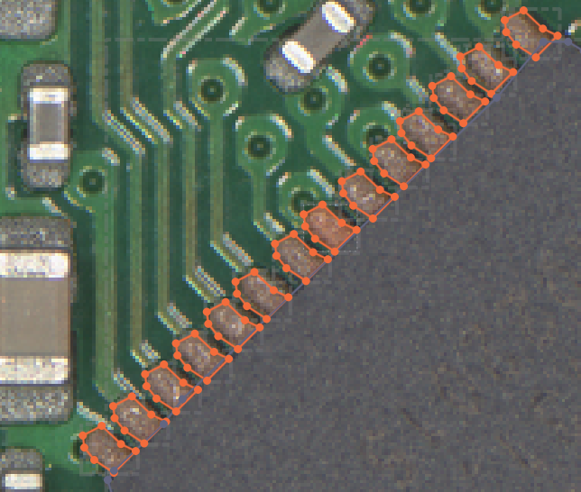
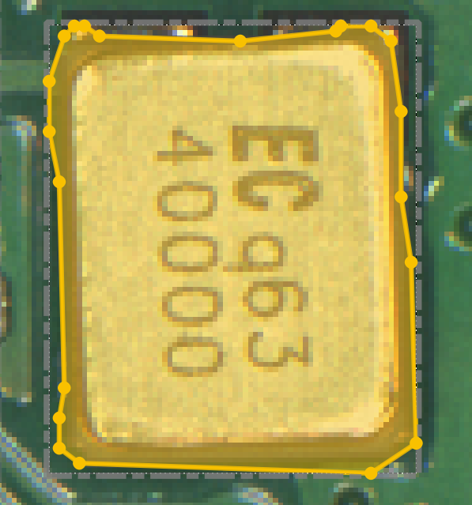
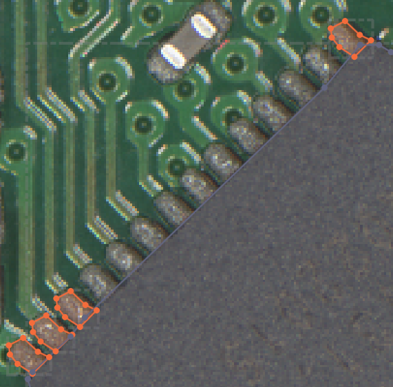
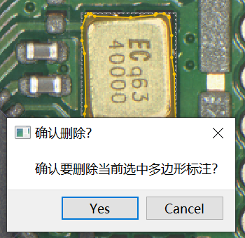
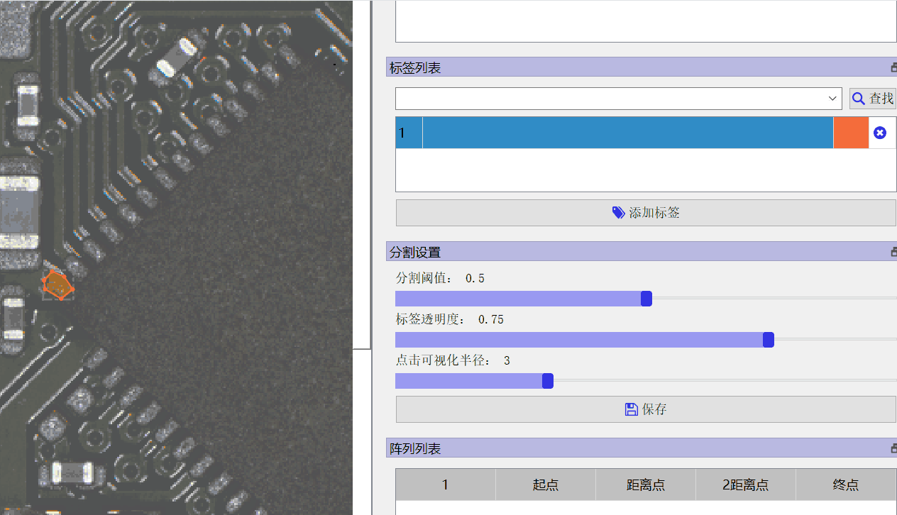
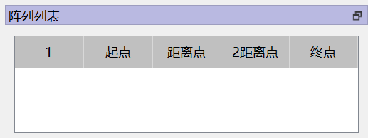

# 阵列功能
你可以通过阵列功能轻松地. 等间距地标注的一排目标,并且对这一排目标调整位置.

>图1 
### 预备知识1: 点击标注的中间区域来"选中标注"

>图2 标注的放大局部图
如上图所示,标注的周围有点和线围成,你需要注意点击中间的区域来选中标注, 不要点击"点"或者"线条".

### 预备知识2: 起点 距离点 2距离点 终点
名词解释: 
- **起点**,表示阵列的第一个点
- **距离点**,距离点到起点的距离,将会是阵列的两个点之间的距离
- **2距离点**,用dist(a,b) 表示点a与点b之间的欧式距离, 那么有
        $2dist(距离点,起点)==dist(2距离点,起点)$. 
为什么要设置2距离点: 仅仅使用[距离点],可能因为人的手动误差,无法准确表示人想要的点之间距离. 采用2距离点能够让点之间的距离更加符合人的需要. 
$阵列之间两点距离D==(dist(距离点,起点)+dist(2距离点,起点)/2)/2$
- **终点**,阵列的终点. 阵列上所有点在起点和终点之间的线段上.完成以上4个点就完成了一个阵列.

>图3 在这个设置下,可以将左下到右上分别为起点,距离点,2距离点,终点.

### 0. 标注的 复制,粘贴,删除,拖动

>图4
删除: 选中标注之后,按下backspace键(🔙),在弹出来的窗口中点击Yes.
复制粘贴: 选中标注之后,按下ctrl+c复制,按下ctrl+v粘贴.
拖动:选中标注,按住左键拖动即可.

### 1.设置起点 距离点 2距离点 终点

1.1 通过复制粘贴,拖动的方式,将标签拖到类似图3的样子
1.2 **先选中标注**,然后点击"起点",这样就设置好了起点.以此类推设置距离点\2距离点\终点

>图5 先选中标注,然后再点击上图中的起点,来设置起点.

1.3 当设置好了终点,就会自动将所有标注补齐,如图1所示.可以手动调整每一个标注的具体位置.

由于工具本身的限制,无法实现对称\旋转等功能.

