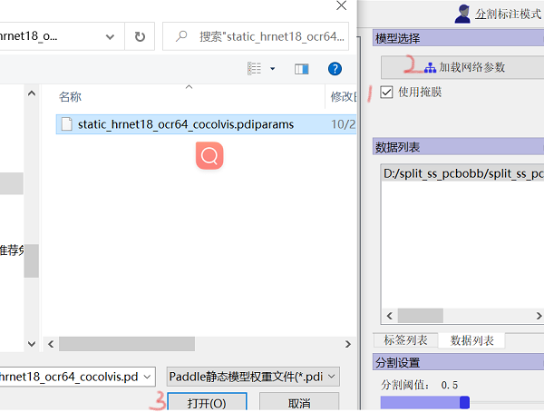
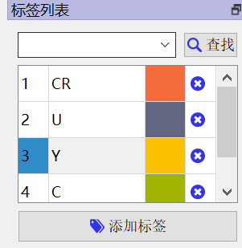
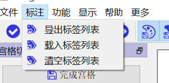
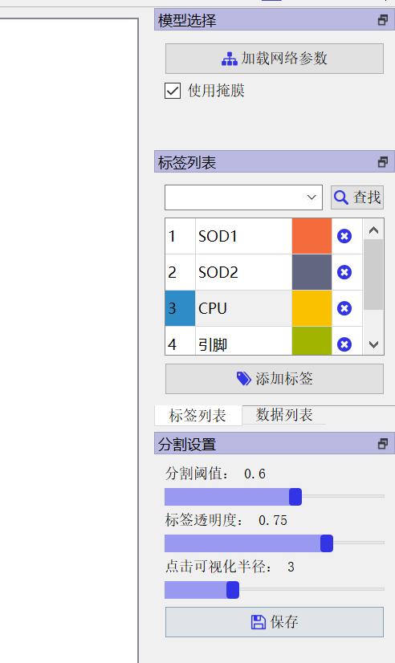
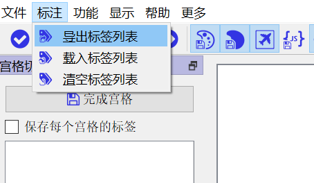
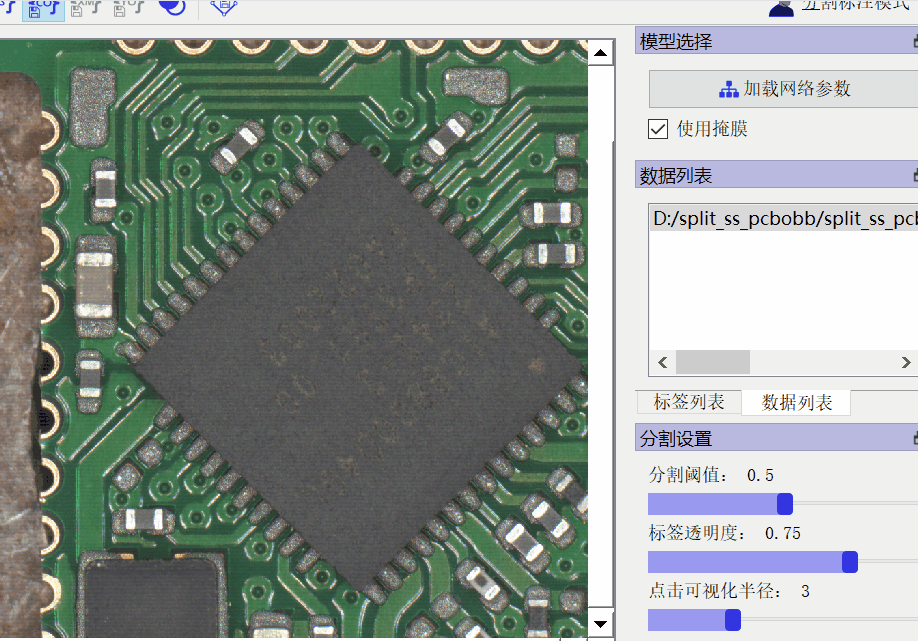
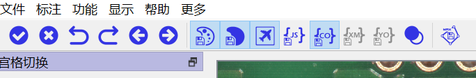
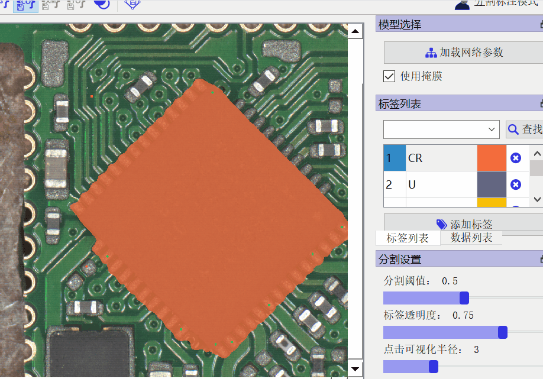
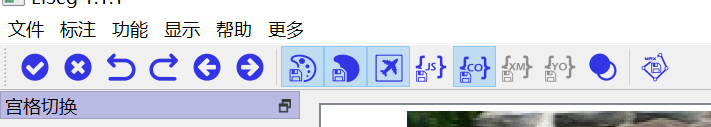

简体中文 | [English](image_en.md)

# PCB图片标注

本部分是JRS项目的PCB元件分割图片标注流程. 

## 模型准备

在使用EISeg前，请先下载模型参数。

| 模型类型   | 适用场景                   | 模型结构       | 模型下载地址                                                     |
| ---------- | -------------------------- | -------------- | ------------------------------------------------------------ |
| 高精度模型 | 通用场景的图像标注 | HRNet18_OCR64  | [static_hrnet18_ocr64_cocolvis](https://paddleseg.bj.bcebos.com/eiseg/0.4/static_hrnet18_ocr64_cocolvis.zip) |
| 轻量化模型 | 通用场景的图像标注 | HRNet18s_OCR48 | [static_hrnet18s_ocr48_cocolvis](https://paddleseg.bj.bcebos.com/eiseg/0.4/static_hrnet18s_ocr48_cocolvis.zip) |

**NOTE**： 将下载的模型结构`*.pdmodel`及相应的模型参数`*.pdiparams`需要放到同一个目录下，加载模型时只需选择`*.pdiparams`结尾的模型参数位置即可， `*.pdmodel`会自动加载。
其中，`高精度模型`推荐使用带有显卡的电脑，以便获得更流畅的标注体验。
使用时请勾选`使用掩膜`。

## 使用

打开软件后，在对项目进行标注前，需要进行如下设置：

1. **模型参数加载**

   根据标注场景，选择合适的网络模型及参数进行加载。选择合适的模型及参数下载解压后，模型结构`*.pdmodel`及相应的模型参数`*.pdiparams`需要放到同一个目录下，加载模型时只需选择`*.pdiparams`结尾的模型参数位置即可。
   
   模型初始化时间稍长，可能会显示"未加载","无响应",鼠标变成加载无法选取等等, 请耐心等待模型加载完成后进行下一步操作。正确加载的模型参数会记录在`文件-近期模型参数`中，可以方便切换，并且下次打开软件时自动加载退出时的模型参数。

2. **图像加载**

   打开图像/图像文件夹。当看到主界面图像正确加载，`数据列表`正确出现图像路径即可。本项目有很多图片,建议导入文件夹. 

3. **标签添加/加载**

   添加/加载标签。可以通过`添加标签`新建标签，标签分为4列，分别对应像素值、说明、颜色和删除。
   

   
   新建好的标签可以通过`保存标签列表`保存为txt文件，其他合作者可以通过`加载标签列表`将标签导入。通过加载方式导入的标签，**重启软件**后会自动加载。
   

⚠注意⚠ **请使用同一个标签列表文件!!** 请一个人将所有的元件类别添加到标签列表当中, 然后导出标签列表. 其他数据标注者导入此标签列表,并且在标注过程之中找到对应的标签进行标注, 其他标注者不要自己另外加任何标签. 
请使用同一个标签列表来标注所有元件。具体而言，虽然每一张图片当中只有一个元件，但是也请一次性列出所有的元件类型，导出标签列表，然后每次导入列表来标注。如果每次重新添加标签，那么虽然标签名称一样，但是标签的编号其实是不一样的。
一次性列出所有标签

导出标签列表

每次对于一张新的图片标注的时候，载入标签列表。

4. **开始标注**

    标注首先进入交互式分割模式。鼠标左键代表正点击，表示所选择的前景部分，鼠标右键代表负点击，为用户选定的背景区域。用户可以通过正负点击操作来选择感兴趣的区域， 直到满意为止。
    
    

    
 上图操作步骤:1.选择"标签列表" 2.选择标签(此处标签CR) 3.左键点击自动选择区域 4.再一次点击左键继续选择 5. 右键点击不想选择的区域. 如果误操作了,可以点击左上角的进行撤销.   

    
 
     
 从左到右第3个即为撤销. 鼠标停留在各个按钮上一会儿后, 可以显示各个按钮的功能.  

    交互完成后使用Space(空格)完成交互标注，此时出现多边形边界，进入多边形标注模式。多边形可以删除，使用鼠标左边可以对锚点进行拖动，鼠标左键双击锚点可以删除锚点，双击两点之间的边则可在此边添加一个锚点。
    
    
 按空格之后出现多边形,然后按照上面的操作进行设置 

    
    ⚠注意⚠ 请使用多边形边界的功能,划出准确的引脚轮廓边界. 这个轮廓很重要. 
5. **完整当前目标的标注**
    完成一个目标的标注之后，点击左上角的✔来保存当前目标的标注，然后再选择一个标签进行下一个目标的标注。
    

6. **保存**
    完成标注之后,点击右下角的"保存"进行保存. 会弹出窗口"完成最后一个目标?". 请确认您已经完成了所有的标注,然后点击Yes来进行保存. 结果会保存到你选择的文件夹之下的`label/`文件夹之下. 

当设置完成后即可开始进行标注，默认情况下常用的按键/快捷键如下，如需修改可按`E`弹出快捷键修改。

| 部分按键/快捷键       | 功能              |
| --------------------- | ----------------- |
| 鼠标左键              | 增加正样本点      |
| 鼠标右键              | 增加负样本点      |
| 鼠标中键              | 平移图像          |
| Ctrl+鼠标中键（滚轮） | 缩放图像          |
| S                     | 切换上一张图      |
| F                     | 切换下一张图      |
| Space（空格）         | 完成标注/切换状态 |
| Ctrl+Z                | 撤销              |
| Ctrl+Shift+Z          | 清除              |
| Ctrl+Y                | 重做              |
| Ctrl+A                | 打开图像          |
| Shift+A               | 打开文件夹        |
| E                     | 打开快捷键表      |
| Backspace（退格）     | 删除多边形        |
| 鼠标双击（点）        | 删除点            |
| 鼠标双击（边）        | 添加点            |

## 特色功能使用说明

- **多边形**

    - 交互完成后使用Space（空格）完成交互标注，此时出现多边形边界；
    - 当需要在多边形内部继续进行交互，则使用空格切换为交互模式，此时多边形无法选中和更改。
    - 多边形可以删除，使用鼠标左边可以对锚点进行拖动，鼠标左键双击锚点可以删除锚点，双击两点之间的边则可在此边添加一个锚点。
    - 打开`保留最大连通块`后，所有的点击只会在图像中保留面积最大的区域，其余小区域将不会显示和保存。

- **保存格式**

    - 打开保存`JSON保存`或`COCO保存`后，多边形会被记录，加载时会自动加载。
    - 若不设置保存路径，默认保存至当前图像文件夹下的label文件夹中。
    - 如果有图像之间名称相同但后缀名不同，可以打开`标签和图像使用相同扩展名`。
    - 还可设置灰度保存、伪彩色保存和抠图保存，见工具栏中7-9号工具。

- **生成mask**

    - 标签按住第二列可以进行拖动，最后生成mask时会根据标签列表从上往下进行覆盖。

- **界面模块**

    - 可在`显示`中选择需要显示的界面模块，正常退出时将会记录界面模块的状态和位置，下次打开自动加载。

- **垂类分割**

    EISeg目前已添加对遥感图像和医学影像分割的支持，使用相关功能需要安装额外依赖。

    - 分割遥感图像请安装GDAL，相关安装及介绍具体详见[遥感标注垂类建设](remote_sensing.md)。
    - 分割医学影像请安装SimpleITK，相关安装及介绍具体详见[医疗标注垂类建设](medical.md)。

- **视频标注及3D医疗图像标注**

    EISeg目前已添加对视频标注和腹腔多器官及ct椎骨数据3D医疗图像标注的支持，使用相关功能需要安装额外依赖。

    - 视频标注及3D医疗图像标注请安装VTK，相关安装及介绍具体详见[视频标注功能](video.md)。

- **脚本工具使用**

    EISeg目前提供包括标注转PaddleX数据集、划分COCO格式以及语义标签转实例标签等脚本工具，相关使用方式详见[脚本工具使用](tools.md)。
