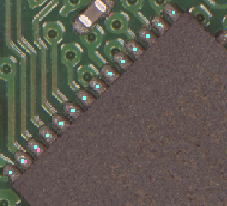
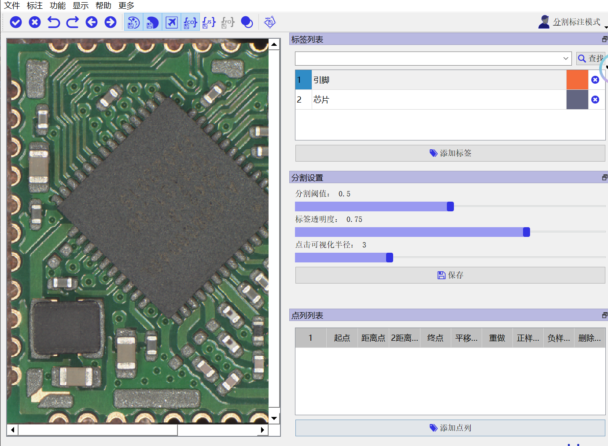
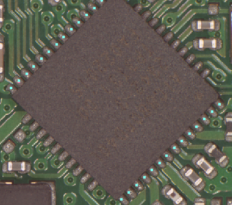
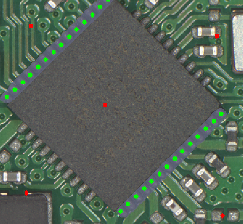
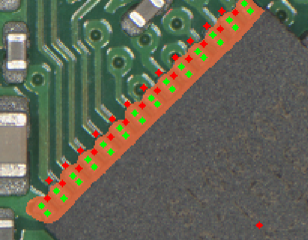

# 点列功能说明

点列功能是指：通过点少量“锚点”，确认一条直线，从而获得一条直线上的许多标注点(一列点,所以叫做点列)，辅助人工分割标注。

> 图0 上图中粉红色的是"锚点",描述了点列的起点终点,和点之间的距离.蓝色的是点列,将会作为标注点参与标注.

锚点包括:起点,距离点,2距离点,终点,平移起点(可选).

# 1. 安装
与[安装说明](docs\install.md)类似,只不过需要从[笔者建立的仓库 jrsPaddleSeg](
https://github.com/Liu-Hong-Xin-1219/jrsPaddleSeg)执行 方法2克隆到本地 , 执行具体安装操作如下:
前面部分paddlepaddle的安装等和说明书一致.
### 方法: 克隆到本地
请**确保**您已经完成了PaddlePaddle的安装之后再执行接下来的步骤。paddlepaddle的安装在本页上面的部分。您也可以执行下面的指令快速安装paddlepaddle
```shell
python -m pip install paddlepaddle==2.6.1 -i https://pypi.tuna.tsinghua.edu.cn/simple
```
通过git将PaddleSeg克隆到本地：

```shell
git clone https://github.com/Liu-Hong-Xin-1219/jrsPaddleSeg
```

安装所需环境,如果你之前已经安装了paddleseg, **此步可以跳过**：

```shell
pip install -r requirements.txt
```

安装好所需环境后，进入EISeg，可通过直接运行eiseg打开EISeg：

```shell
cd jrsPaddleSeg\EISeg
python -m eiseg
```

或进入eiseg，运行exe.py打开EISeg：

```shell
cd jrsPaddleSeg\EISeg\eiseg
python exe.py
```
# 2. 界面说明

> 图1

请见右下角的"点列列表". 点击"添加点列"之后,添加一行.下面描述一行各个格子的含义.
- **序号**,表示当前点列的序号,不可点击,在本项目中没有含义.
- **起点**,表示点列的第一个点
- **距离点**,距离点到起点的距离,将会是点列的两个点之间的距离
- **2距离点**,用dist(a,b) 表示点a与点b之间的欧式距离, 那么有
        $2dist(距离点,起点)==dist(2距离点,起点)$. 
为什么要设置2距离点: 仅仅使用[距离点],可能因为人的手动误差,无法准确表示人想要的点之间距离. 采用2距离点能够让点之间的距离更加符合人的需要. 
$点列之间两点距离D==(dist(距离点,起点)+dist(2距离点,起点)/2)/2$
- **终点**,点列的终点. 点列上所有点在起点和终点之间的线段上.完成以上4个点就完成了一个点列.
- **平移起点**, 将上面完成的点列平移,以[平移起点]作为新的起点. 可以点多个平移起点,再一次点击平移起点按钮重置所有平移起点.

> 图2 上部分的点是原本的点列,下半部分是平移之后的点列.

- **重做**, 删除所有锚点和点列 
>如果你想重做的时候不一定要点重做按键,你可以:
> 步骤1. 直接点击你想要修改的点的按钮,然后重点
> 步骤2. 点击终点,重新绘制点列.
- **正样本点保存**: 这些点会假设是你点击鼠标左键点击的,也就是绿色的点

> 图3 图中绿色的点是图2的点列变成的正样本点,红色的是我人工点的负样本点,灰色的是分割出来的引脚.以上分割不准确,仅作示例
- **负样本点保存**: 这些点会假设是你点击鼠标右键点击的,也就是红色的点
- **删除并取消**, 删除所有锚点,点列,取消点列绘制. **已经被保存为样本点,则无法删除和取消,只能够使用程序自带的撤回来取消.**

# 3. 操作步骤举例
下面描述一个一般的操作步骤
0. 选择模型,导入图片,导入标签列表,**选择某一个标签**, 以上步骤是分割标注的一般步骤,刚开始的时候有一点卡顿,属于程序加载正常现象.
1. 点击起点按钮,在左侧图像中选择起点
2. 依次绘制距离点\2距离点\终点, 获得点列.
3. (可选),点击平移起点按钮,然后点击平移起点,将步骤2中的点列复制一份平移到平移起点的位置.
4. 点击正样本点保存或者负样本点保存
5. 等待一会儿,由于点了多个点,绘制分割掩码的步骤可能比较慢.
6. 完成绘制,调整"分割设置"当中的"分割阈值"来调整分割掩码, 调整"点击可视化半径"改变点的大小方便查看. 

# 4. 点列使用技巧
可以考虑使用多个点列来描述一列引脚:

