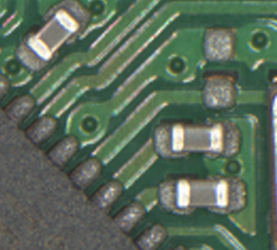
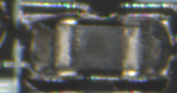
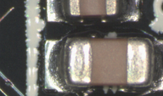
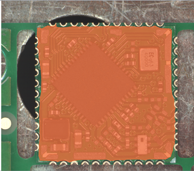
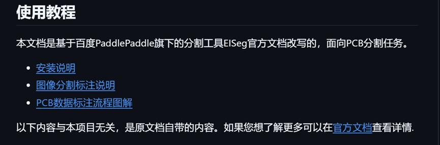

# PCB分割数据集要求文档
### 0.  引言
这是描述PCB进行元件分割所需要的数据集的文档，本文档描述了数据集当中所需要的各种数据类型和对不同类型的数据的描述。 

PCB分割数据集是根据您方制作的标准板产生的，但是标准板和实际的使用环境接触到的pcb板子有差别。在实际的应用当中，模型会见到各种不同的型号的pcb板子，这些板子的元件排布和使用的元件类型各不相同。

最好的训练数据需要接近生产环境，也就是是每一种元件都能见到若干个不同的实际元件，并且能够见到元件在pcb上排列的若干种方式。

  
* 图1  图中一种类型的元件有三个不同的实际元件, 这种例子能够让模型更好地学习同一种元件之间的共同特征,忽略掉一些加工不规整导致的轻微外形不同. 当然不同的实际元件不一定要在同一块板子上.

所以，我拿到您方的标准版之后，会进行用拼接的方式进行数据生成。具体而言，会根据您方提供的标准版获得各个种类的元件的引脚级分割掩码标签和分割出来的局部rgb，将他们随机排列到一块空板子上，生成若干PCB的RGBD图和对应的引脚级掩码标签。

综上所述，我方希望得到的数据是：
1) 单个元件的RGBD图像
2) 单个元件对应的引脚级别的分割掩码标签与类别信息 
3) 空板子的RGBD图像和有效区域掩码以及可能的元件布局方式
4) 其他可能出现在PCB上的物体的RGBD图像(例如焊锡)
 下面会详细描述各个要求. 

### 1.	单个元件的RGBD图像
**内容要求:** 单个元件RGB图像, 深度图用另一张图片保存.

   
- 图2上图为好, 因为只有一个元件. 下图为差,因为图中不止一个元件.

**数量要求:** 每一种元件至少要有两个实际的元件, 越多越好. 
### 2.	单个元件对应的引脚级别的分割掩码标签 与 类别信息
**内容要求:** 此处强调 1)要勾画出引脚的轮廓; 2) 类别信息要统一, 要统一使用一套”标注列表”. 详情请见《数据标注工具EISeg教程》-数据标注章节. 拍摄时尽可能模拟多种环境, 例如流水线上可能的各种光照条件.
**数量要求:** 分割掩码要和单个元件的RGBD图像一一对应. 

### 3.	空板子的RGBD图像和有效区域掩码以及可能的元件布局方式
**描述:** 如果能够提供空板子上可能的元件布局方式, 我就会按照这种布局来将元件放在对应位置上生成数据, 这种数据能够让模型学习到合理的PCB元件布局, 更加符合实际生产情况.  
**内容要求:** 没有元件的空PCB的RGB图像和深度图. 元件在PCB上的位置可以用边界框来表示位置和旋转角度, 请明确提供的边界框的坐标信息是中心点还是左上角点. 在拍摄空板子的时候, 请放在导轨的不同位置进行拍摄, 否则模型可能将重复出现的导轨认为是有意义的信息进行记忆. 拍摄时尽可能模拟多种环境, 例如流水线上可能的各种光照条件.
请提供空板子“可以焊元件的”区域，也就是有效区域掩码

**数量要求:** 最少4种空板子, 每种空板子在导轨的不同位置拍摄2张. 空板子数量越多越好. 
可以没有”可能的元件布局方式”, 元件布局方式可以只提供空板子对应的标准板的版本, 不一定要和RGBD图吻合, 当然最好能够提供与空板子RGBD图校准的元件布局方式.

附录：数据标注工具文档
Liu-Hong-Xin-1219/PaddleSeg (github.com)
这个仓库是我根据官方文档改写的，适用于本项目的文档。请不要使用其中的代码。请从下图的链接开始看起
